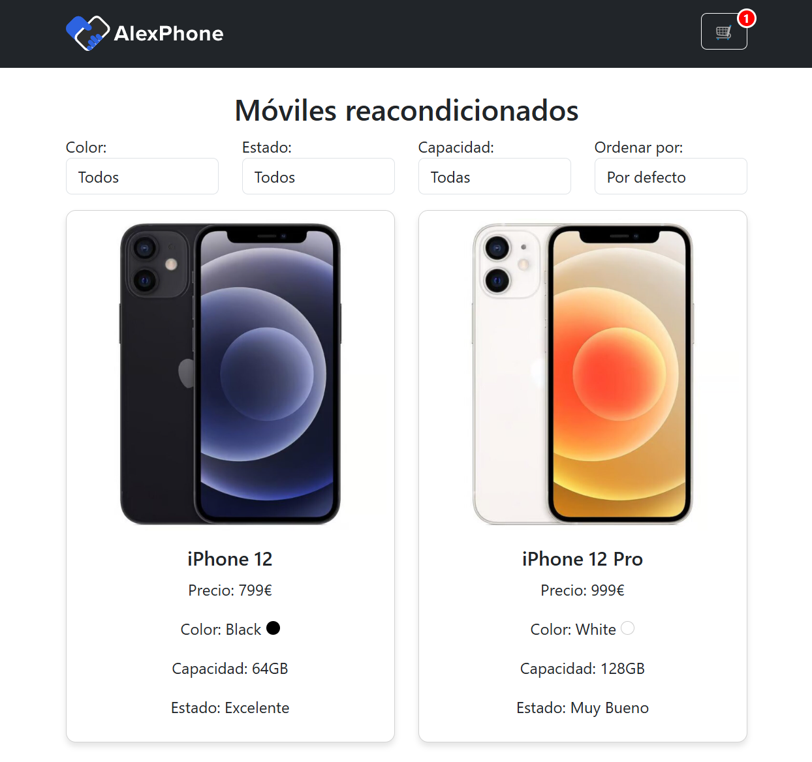

# 📱 AlexPhone E-Commerce

Bienvenido a **AlexPhone**, un e-commerce de móviles reacondicionados donde los usuarios pueden explorar productos, filtrarlos y ordenarlos, ver detalles y realizar compras.

## 🚀 Tecnologías utilizadas

- **Angular 19** - Framework frontend
- **TypeScript** - Tipado fuerte y desarrollo estructurado
- **Bootstrap** - Diseño responsivo
- **RxJS** - Manejo de datos reactivos
- **ESLint & Prettier** - Código limpio y formateado

## 📌 Características principales

✅ **Lista de iPhones en formato grid** con imagen, precio y características.  
✅ **Filtros avanzados** por color, estado y capacidad.  
✅ **Persistencia de filtros en la URL** para compartir resultados.  
✅ **Página de detalles** con toda la información y opción de añadir al carrito.  
✅ **Carrito de compras** con almacenamiento en LocalStorage.  
✅ **Realización de pedidos con integración a API**.  
✅ **Navbar con contador de productos en carrito**.  
✅ **Diseño responsive**, con filtros ocultables en dispositivos móviles.  
✅ **Alertas Bootstrap en vez de `alert()`** para mejorar UX.  
✅ **Pruebas unitarias y de integración** con Jasmine/Karma.  
✅ **Despliegue en Netlify**.

## Screenshot



## 📂 Estructura del proyecto

```
src/app/
│── components/        # Componentes reutilizables (navbar, cards)
│── pages/             # Páginas principales (home, product-detail, cart)
│── services/          # Servicios para la API y carrito
│── models/            # Interfaces y tipos
│── app.component.ts   # Componente raíz
│── app.routes.ts      # Configuración de rutas
```

## 🛠️ Instalación y ejecución local

1. Clonar el repositorio:
   ```bash
   git clone https://github.com/adptCode/alexphone-alessandro.git
   cd alexphone-alessandro
   ```

2. Instalar dependencias:
   ```bash
   npm install
   ```

3. Ejecutar el proyecto:
   ```bash
   ng serve
   ```

4. Abrir en el navegador:  
   👉 **http://localhost:4200**

## ✅ Pruebas unitarias e integración
Para ejecutar los tests:
```bash
ng test
```

## 🚀 Despliegue en Netlify
Para hacer deploy manual en Netlify:
1. Compilar el proyecto:
   ```bash
   ng build --configuration=production
   ```
2. Subir la carpeta `/dist` a Netlify.
3. Configurar como sitio estático y listo.
4. Puedes ver el proyecto desplegado aquí: 🌍 [Netlify](https://alexphone-alessandro.netlify.app/)

## 📝 Autor
👨‍💻 **Alessandro De Pietri Tonelli**  
🔗 [LinkedIn](https://www.linkedin.com/in/alessandrodpt) | 🌐 [Portafolio](https://alessandrodpt.netlify.app/)

---
🎯 **Si tienes feedback o sugerencias, estaré encantado de escucharlas!** 🚀


